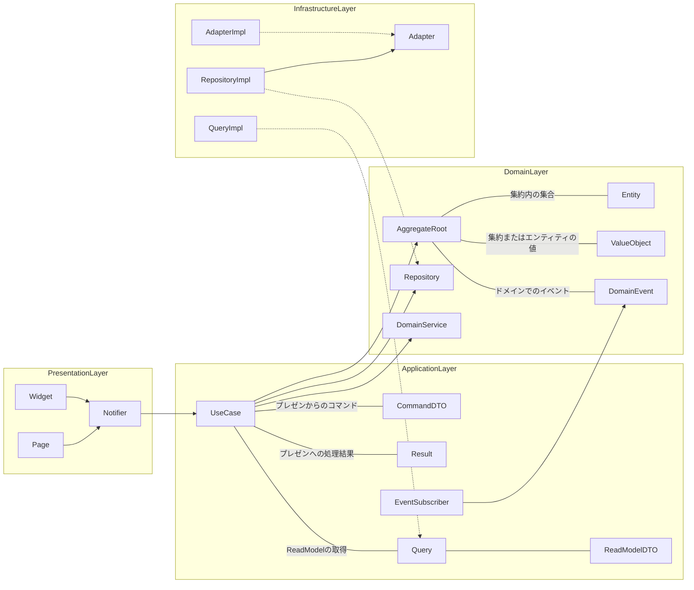

# タスク管理アプリケーション「日々タスク」
このリポジトリはFlutterアプリケーション「日々タスク」のリポジトリとなります。  
このアプリケーションは、現状Androidのみを対象とした実装となっております。

## 仕様ドキュメントについて
開発初期のドキュメントは ``` ./document ``` 以下においています。  
内容については、開発初期のクラス図・概念モデル図・ユースケース図・ワイヤーフレームなどが含まれます。

## makeコマンドについて
アプリケーションのビルドやビルドに必要なファイルを生成するコマンドなどは、makeコマンドにまとめています。  
ただし、開発者の環境がMacOSなので、その他の環境が考慮されていませんので、ご注意ください。

#### セットアップ
以下コマンドでビルドに必要なファイルを展開します。
```
make setup
```

#### KeyStoreの生成
以下コマンドで、Androidのビルドに必要なKeyStoreファイルを生成します。
```
make create-android-key
```

#### AppBundleの生成
以下コマンドで、Androidリリースに必要なのaabファイルを生成します。  
生成されたaabファイルは ``` ./app.aab ``` として生成されます。
````
make create-app-bundle
````

#### AppBundleのインストール
bundletoolを使用して、以下コマンドでAndroidスマホにapp-bundleファイルをインストールします。  
bundletoolをインストールして、セットアップのmakeコマンドを実行してから実行してください。
````
make install-app-bundle
````
このコマンドでは、``` ./bundle.sh ``` のシェルを実行するのですが、ファイルの変数にビルドのための（主にKeyStore）設定をしていただく必要があります。  
以下は、変数設定についてです。
```sh
KEY_STORE_PASS=xxx # key.jksに設定したキーストアのパスワード
KEY_PASS=xxx # key.jksに設定したキーのパスワード
AAB_PATH=./build/app/outputs/bundle/release/app-release.aab # 使用するaabファイルのパス
APKS_PATH=./app.apks # 生成するapksファイルのパス
KEY_STORE_PATH=./android/key.jks # キーストアファイルのパス
KEY_ALIAS=key # キーエイリアスですが「key」のままで問題ないかと思います
```

#### テストの実行
本アプリケーションはモノリスもジュラのようなアーキテクチャを採用しており、以下コマンドを実行するとモジュールのテストを実行します。
```
make test-module
```

## アーキテクチャについて

